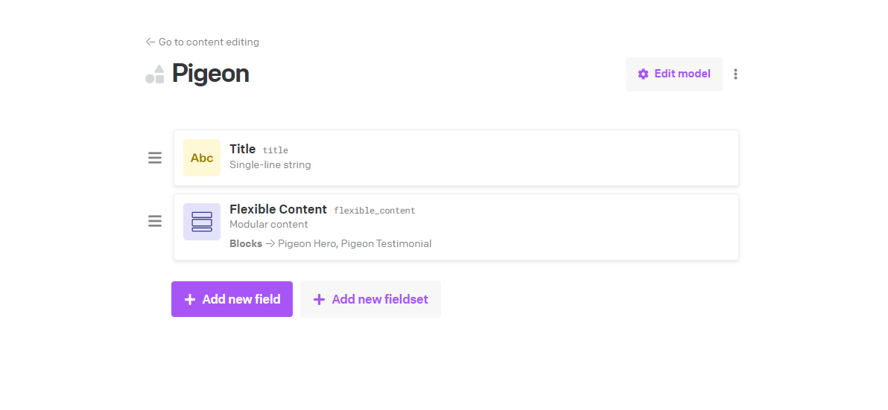
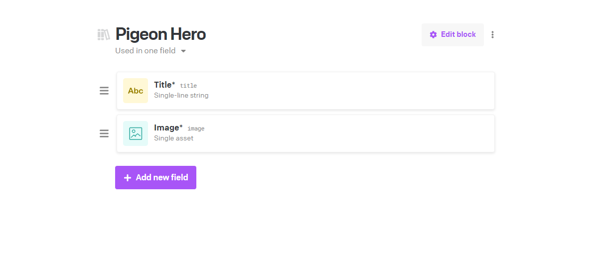
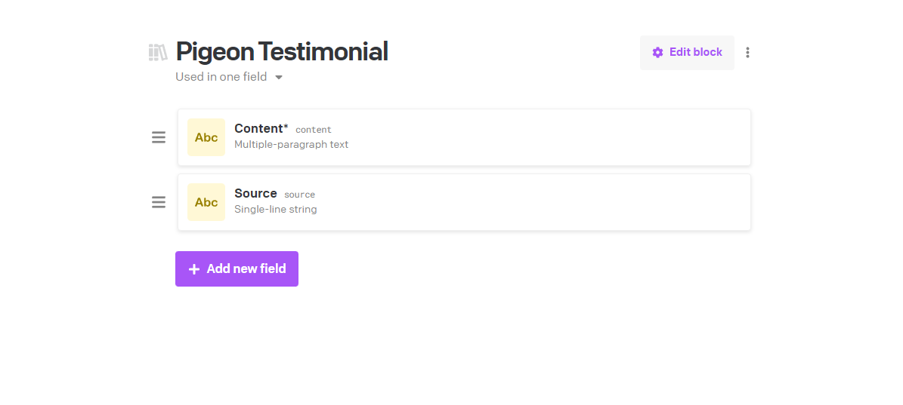

# @adrocodes/pigeon

> Build Jamstack with safety and speed in mind!

---

## What is Pigeon

Pigeon provides a standard way to integrate with a CMS to build content pages. It allows GraphQL queries to be generated for you, collect and de-deupe fragments and validate data against a `zod` schema.

It also allows you to write your components once and create CMS specific integrations. This is done through the `transform` setup on your `zod` schema. Utilising this schema we can also validate incoming data to ensure it is the structure that you are expecting, allowing you to react to CMS changes or alter your components to be more flexible depending on the data.

Pigeon has been designed with the intention to build content heavy sites, where the content is the focus. It's not designed to be a full CMS integration, but rather a way to build out the content pages of your site.

## How it works

With Pigeon you'll be defining a consistent schema for your data which includes a validation model using `zod`, incoming CMS data will be validated against this data to ensure you get the data you're expecting. Additionally, creating dependencies between components will allow you to generate GraphQL queries and collect fragments for those queries to make the integration easy.

### CMS Model Setup

Pigeon works on the assumption that you're allowing clients to structure pages using "blocks" of content, similar to lego. The author has the choice of multiple components to place on the page. I borrow the "Flexible Content" terminology from Advanced Custom Fields (WordPress), but whatever naming works. Essentially in the end you'll be building out a query which will return an array of different components.

#### Model



#### Hero Block



#### Testimonial Block



### Manual GraphQL definition

With the model above, you'd be expected to write a query similar to the one below. We're separating out the different components are fragments, this allows for reuse if a different page content type uses the same component, its better to have a single source of truth.

```graphql
fragment HeroFragment on PigeonHeroRecord {
  id
  title
  image {
    url
    alt
  }
}

fragment TestimonialFragment on PigeonTestimonialRecord {
  id
  content
  source
}

query PigeonPage {
  pigeon {
    flexibleContent {
      __typename
      ... on PigeonHeroRecord {
        ...HeroFragment
      }
      ... on PigeonTestimonialRecord {
        ...TestimonialFragment
      }
    }
  }
}
```

### Data transformation

There are 2 ways you can approach building your site:

1. Base your component props on the CMS data - from experience this usually results in me rebuilding a Hero banner every project.
2. Build generic components and transform your CMS data to match your props.

Option 2 is my favourite, it promotes reusability across projects and means you can continually build up a collection of components you can use across new projects. Saving time and allowing you to focus on building cool shit.

With option 2 in mind, once we have our data we need to run some transformation on it. You'll most likely set up some type of mapping object to map the `__typename` to a transformation function and loop through the data each and transform each as needed.

```ts
const mapping = {
  // These functions will probably be extracted into another file somewhere
  PigeonHeroRecord: (input: HeroCmsData): HeroProps => {...},
  PigeonTestimonialRecord: (input: TestimonialCmsData): TestimonialProps => {...}
}

const data = client.query(...)

return data.pigeon.flexibleContent.map((value) => {
  return mapping[value.__typename](value)
})
```

This will mostly likely cause some TypeScript errors about mismatching types or possible undefined errors, but in that cause nothing a good old `any` can't fix.

### Reacting to model changes

At some point during the project you'll need to change one or more of these integrations to better reflect what a client might want. At this point you'll need to find all the files that use this component and update them. This could be spread across multiple files and folders, and if you're using TypeScript you'll need to update the types as well. This could cause a lot of errors and take some time to update everything correctly.

## Comparing this to Pigeon

Pigeon moves the transformation logic into the schema definition, this means that you can define the transformation logic in one place and use it across all your components. This also means that if you need to update the transformation logic you only need to update it in one place.

It also streamlines the process of building out the GraphQL query, collecting and de-duping fragments making that process effortless.

Finally, using `zod` to validate the data means that you can be sure that the data you're getting is the data you're expecting. This means you can react to changes in the CMS data structure and update your components accordingly.

Check out the Pigeon demo project to see how it works in practice. [Demo Github](https://pigeon-demo.vercel.app/)

### Setup:

```bash
npm i @adrocodes/pigeon zod
```

```bash
yarn add @adrocodes/pigeon zod
```

```bash
pnpm i @adrocodes/pigeon zod
```

### Registering components

First you'll want to create component definitions for each of your components. These will be used to generate the GraphQL query, type definitions, validate and transform your data.

```ts
import { createRegistration } from "@adrocodes/pigeon"

const ImageAsset = createRegistration({
  __typename: "FileField",
  // No need to worry about the `fragment ....` part, this will be generated for you
  fragment: `
    url
    alt
    width
    height
  `,
  schema: z
    // This is the schema for the incoming data
    .object({
      __typename: z.literal("FileField"),
      url: z.string().min(1),
      alt: z.string().min(1),
      width: z.number().positive(),
      height: z.number().positive(),
    })
    // Transform this data into what you need
    .transform((input) => {
      return {
        ...input,
        __typename: "Image",
        src: input.url,
      }
    }),
  // Usually this is auto-generate, but you can override it if you need to
  fragmentName: "ImageFragment",
})

const HeroIntegration = createRegistration({
  __typename: "HeroRecord",
  // Use other registrations to build up your fragment
  fragment: `
    id
    heading
    description
    heroImage {
      ...${ImageAsset.fragmentName}
    }
  `,
  // Add any dependencies that you use in your fragment
  dependencies: [ImageAsset],
  schema: z
    .object({
      __typename: z.literal("HeroRecord"),
      id: z.string().min(1),
      heading: z.string().min(1),
      description: z.string().optional(),
      // Make schema references to other registrations - this will validate and transform the data
      // meaning you only need to update the schema in one place
      heroImage: ImageAsset.schema,
    })
    .transform((input): HeroIntegrationProps => {
      return {
        ...input,
        __typename: "Hero",
        title: input.heading,
        image: input.heroImage,
        description: input.description ?? undefined,
      }
    }),
})

const TestimonialIntegration = createRegistration({...})
```

Once you've created all your registrations (these can be spilt across files to keep things tidy) you'll need to register them with Pigeon.

```ts
import { createPigeon } from "@adrocodes/pigeon"

const pageInstance = createPigeon([HeroIntegration, TestimonialIntegration])
```

Import here, you only need to register "top-level" components, any dependencies will be pulled in automatically.

Pigeon also exports `input` and `output` helper types, these are used get type the incoming GraphQL data and the expected output of the validate function.

```ts
import { createPigeon, type input, type output } from "@adrocodes/pigeon"

const pageInstance = createPigeon([HeroIntegration, TestimonialIntegration])
type PageInput = input<typeof pageInstance>
type PageOutput = output<typeof pageInstance>
```

### Building the query

Now that you've registered your components you can build the GraphQL query.

```ts
const query = `
${pageInstance.fragments()}

query PigeonPage {
  pigeon {
    flexibleContent {
      __typename
      ${pageInstance.query()}
    }
  }
}
`
```

This will generate the same query we saw earlier, but all you need to do is update the `pageInstance` and the query & fragments will update automatically.

I wanted to keep the query as close to the original as possible, so you can still modify the query easily if you need to, adding extra fields, arguments etc.

You can now call your GraphQL endpoint with the query and get back the data.

### Validation data

In our case the data will follow the following structure:

```ts
type QueryResponse = {
  page: {
    flexibleContent: PageInput
  }
}
```

We can use the `validate` function to validate the data and transform it into the expected output.

```ts
const data = await client.query<QueryResponse>(query)

const validatedData = pageInstance.validate(data.page.flexibleContent)
```

This will validate the data and transform it into the expected output. Matching the `PageOutput` type we defined earlier.

We can be confident that the data we're getting is the data we're expecting. If the data doesn't pass the validation it will throw an error.

From here, you can return this data to your components and use it as you would normally.

Check out the Pigeon demo project to see how it works in practice. [Demo Github](https://pigeon-demo.vercel.app/). Currently we have examples for integrating with Hygraph and DatoCMS in the same project. We'll be adding more examples in the future.
